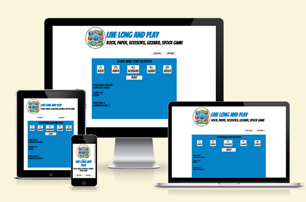
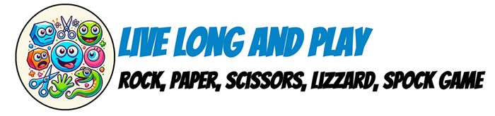
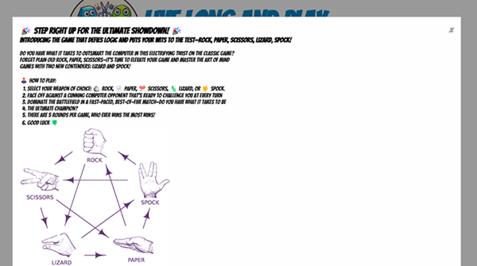
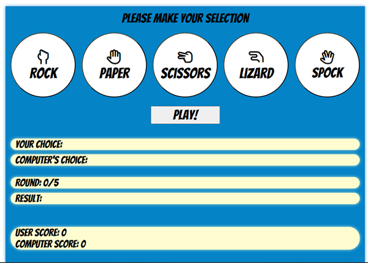
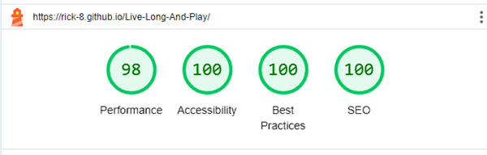
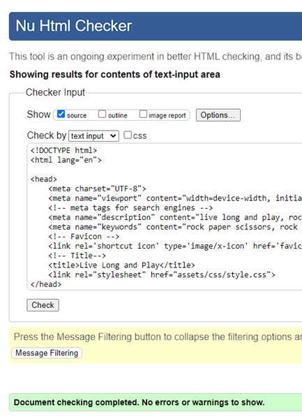
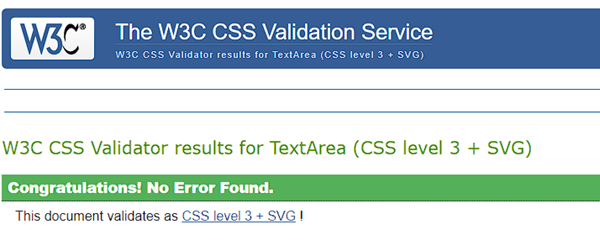
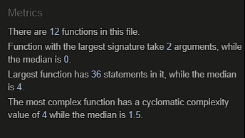
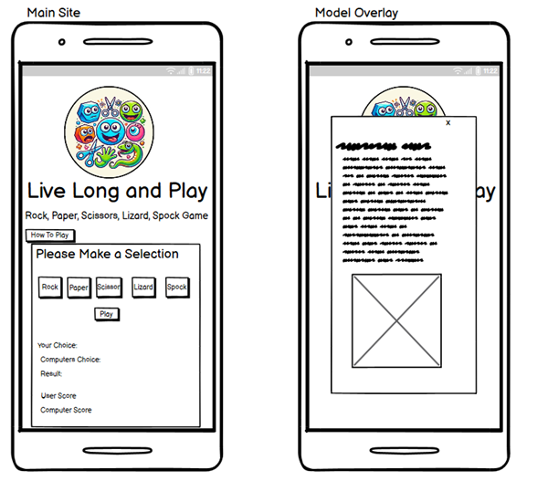
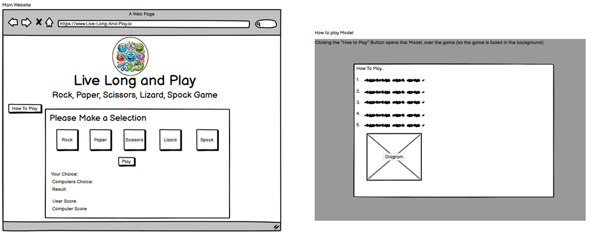

# Live Long and Play
A Rock, Paper, Scissors, Lizard, Spock Game

### 🎉 Step Right Up for the Ultimate Showdown! 🎉
Introducing the game that defies logic and puts your wits to the test—Rock, Paper, Scissors, Lizard, Spock!

Do you have what it takes to outsmart the computer in this electrifying twist on the classic game? Forget plain old Rock, Paper, Scissors—it’s time to elevate your game and master the art of mind games with two new contenders: Lizard and Spock!

**How to Play:**

1. Select your weapon of choice: 🪨 Rock, 📄 Paper, ✂️ Scissors, 🦎 Lizard, or 🖖 Spock.
2. Face off against a cunning computer opponent that’s ready to challenge you at every turn!
3. Dominate the battlefield in a fast-paced, best-of-five match—do you have what it takes to be the ultimate champion?

Ready to play? Click [“Play!”](https://rick-8.github.io/Live-Long-And-Play/) now and immerse yourself in a battle of wits where Rock crushes Scissors, Paper disproves Spock, and Lizard just might eat the competition alive. The only question is: Can you outsmart the unpredictable?

Don’t wait—step into the arena of Rock, Paper, Scissors, Lizard, Spock and show the world what you’re made of!

Play Now and Let the Best Mind Win!

## Project Goal

To create a fun and engaging game where each move is a strategic decision to outwit the computer and rise victorious! With future development, this website holds potential to incorporate pictures instead of text during gameplay and host other games, giving the user fun options for as long as needed.

## Target Audience

The target audience for this game includes:

* **Casual Gamers:**
  - People looking for a quick, fun, and easy-to-learn game.
  - Ideal for individuals who want a game they can play in short bursts during breaks or downtime.

* **Fans of the Classic Rock, Paper, Scissors Game:**
  - Players who enjoy the original game but are seeking something new and more complex.
  - Anyone nostalgic about classic games with a fresh twist.

* **Science Fiction Enthusiasts / Pop Culture Fans:**
  - Fans of The Big Bang Theory TV show, where Rock, Paper, Scissors, Lizard, Spock became popular.
  - People who appreciate the humorous, and enthusiastic side of gaming and enjoy references to pop culture.

* **Students and Young Adults:**
  - Teens and young adults who enjoy quick mental challenges and strategic thinking.
  - Suitable for players aged 12 and up due to its simplicity, yet it offers enough variation to engage older players.

* **Families & Friends:**
  - Families looking for light-hearted competition.
  - A great game for kids to play with parents or siblings.

* **Puzzle and Strategy Game Fans:**
  - Those who like games involving decision-making, pattern recognition, and probability.
  - People who enjoy simple yet strategic games that test their logic and planning skills.

* **Office Workers and Professionals:**
  - Individuals looking for a short, stress-relieving game they can play during lunch or a quick break.
  - Great for social or team-building activities in a work setting.

### Key Characteristics of the Target Audience:
- **Age Group:** 8 and up.
- **Interests:** Casual gaming, pop culture, strategic thinking, and quick, fun challenges.
- **Devices:** Desktop or mobile devices, as it should be accessible for play anywhere.
- **Play Style:** Short and easy-to-understand games that offer a blend of luck and strategy.

By targeting a broad yet focused audience, this game has the potential to attract a wide range of players looking for a quick and engaging experience!

## Features

* **Core Website Design:**
  - The whole website was selected to contain the same font throughout for better UX and overall look.
  - Google font used is selected because it was easy to read, given its playful nature, and works well with the logo and overall theme.
  - Colour schemes were kept minimal using the logo colour scheme and used in contrast to improve UX, making it easy to navigate and understand.
  - Responsive features like button hover effects and cursor changes were added to give the website more appeal.
  - How to Play modal was used to keep the main website clutter-free, allowing the user to play a game that's easier on the eye, improving UX.
  - Gameplay buttons were given the same styling to improve the site look and overall UX.

* ** Favicon**
  - I used Windows Paint to crop the logo down, as it was bright and matched the logo inside for continuity.
  - I then uploaded the file to the website [Favomatic](https://favicomatic.com/) to create the favicon.
  - [Go to code (opens in another window)](index.html#shortcut-icon)

* **Header**
  
  
  
  - I created a logo using AI to give it a fun, bright, and enticing appeal.
  - Heading text was made large and given a subheading, which instantaneously conveys to the user the website's purpose.

* **Top Buttons Section**
  
  - Above the gameplay area, there are 2 buttons.
  - Buttons were used for ease of use, and easy to find so their purpose was clear for the user to make use if if needed.
  
  

  - The Reset Button can be clicked at any time to reset the game. It was added for user control and choice, with hope of giving a greater experience to those who might need it.
  - The How to Play button, when clicked, opens a modal window with information and instructions on how to play, including a diagram to quickly convey the game mechanics.
  
  

* **Gameplay Area**

  

  - The background was chosen to match the favicon, logo center, and heading for UX.
  - Game selection buttons were made large and given FontAwesome icons to enhance UX.
  - A Play button was added to increase user interactivity with the same style theme as the options button above it.

### Future Features
    - The potential to add Graphics instead of writing
    - Add sound to create an auditory back ground atmosphere with responsive sounds on buttons and also on the results given back.
    - Make this website part of a larger game website along side other games

    The above should positively increase the over all User Experience.

  ## Testing 

  **Lighthouse**

  I ran my page through Lighthouse to ensure my site is easy to read and nicely accessible.

  

  - I tested my site on Chrome, Safari and Firefox, and it works well on these browsers.
  - I tested all buttons on the page to make sure they were working, and worked as they should.
  - I tested that the game works, and resets correctly, ready to start another round.

**HTML**
  - HTML code passes the W3C code check

  

  **CSS**
  - CSS passes the W3C code check

  

  **Java Script**
  passed through the https://jshint.com/ script checker finding no faults and producing the summery below.

 

 ## Bugs

   - Firstly I created a second page to create a how to section, but with my mentors insipration I decided to change to a model, I used the W3C page to learn how to do 
     this, and I feel this is a great was to convey the relivent information to the user, and 
   - Following the the first game and after resetting I found that the game didnt run as it did before, the scores were adding wrong and and not resetting correctly.
      to overcome this, I corrected the event listeners for both the play and reset buttons, so that the game would reset properly and the play button would also work as before.
   - There were various minor errors in the HTML and JS code that I was quickly able to discover, because I was running my code through the W3 validation services and 
     jshint.com at periodic points, making sure the code was right. I also used the Google Developer Tools to test and iron out little kinks in my HTML and CSS code.

## Deployment

- Version Control

  - The site was created using the Gitpod editor and pushed to the remote Live Long and Play repository on Github.com
  - Git commands were used regularly during the construction of the club website using the following Git commands
  - Git add . - to add files to the staging area before being committed
  - Git commit -m "commit title" - to commit a file to the queue ready for the final process.
  - Git push - used to send the committed files to the Github repository.
  - Deployment to Github pages

- I used the following steps to deploy using the Github pages as follows

  - Once inside the repository, I clicked on the settings tab
  - I then went to the pages section
  - Making sure the main branch was selected I then clicked on save and the page URL was created.
  - Please click ["Here”](https://rick-8.github.io/Live-Long-And-Play/) to find the live site Live Long and Play Game.

- Using Gitpod

  - To set up my working IDE I logged in to Gitpod and navigated to the workspaces section
  - Clicking on new workspace and in putting the repository URL,
  - The IDE was created.

## Design Wireframes

 - Making the site I used the mobile first method in developing. I used wireframes to plot a general layout both on Mobile first and being responsive on bigger screens.

  - Mobile phone screens.

 

  - Larger screens

 

    